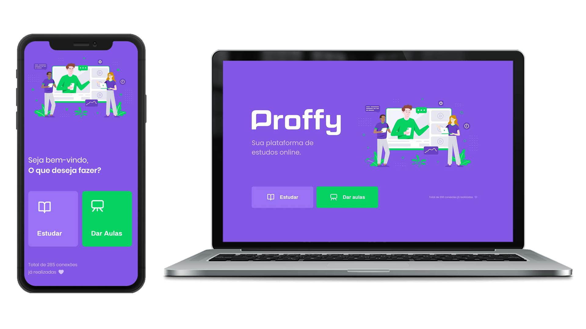

<h1 align="center">
 
  
 
</h1>

Projeto de plataforma educacional com objetivo de conectar alunos e professores.

## 🎨 Main Pages

  
  

## 🎨 Descrição do Projeto

Repositório feito a partir dos conteúdos apresentados durante a **NextLevelWeek#2** , organizada pela [**Rocketseat**](https://rocketseat.com.br). 
O projeto consiste em uma plataforma desenvolvida afim de conectar alunos e professores. A plataforma possui tanto uma versão web quanto uma versão mobile. 

**🔗 Tecnologias utilizadas:**
- [ReactJS](https://pt-br.reactjs.org)
- [NodeJS](https://nodejs.org/en/)
- [React Native](https://reactnative.dev)
- [Express](https://expressjs.com)
- [Expo](https://expo.io/tools#cli)
- [TypeScript](https://www.typescriptlang.org)

**📊 Dependências:**
- [SQLite3](https://www.npmjs.com/package/sqlite3)
- [Axios](https://www.npmjs.com/package/axios)
- [Expo Google Fonts](https://github.com/expo/google-fonts)
- [Knex](http://knexjs.org)
- [Bcrypt](https://www.npmjs.com/package/bcrypt)

## 🖥️ Como executar o projeto ##

1. Faça um clone deste repositório.
2. Instale o Yarn - [neste link](https://classic.yarnpkg.com/en/docs/install/#debian-stable).
3. Com o Yarn instalado, execute o comando `yarn install` nos 3 folders, afim de instalar as dependências do projeto.
4. Para atualizar as dependências do projeto execute o comando `yarn upgrade`.
5. Por fim execute o comando `yarn start` nos diretórios **web** e **server**.
6. Para executar a plataforma **mobile**, será necessário primeiramente instalar o **Expo**. 
7. Após aa instalações do **Expo*, no diretório **mobile**, abra o terminal e execute o comando `expo start`, por fim escaneie o **QR code**.

